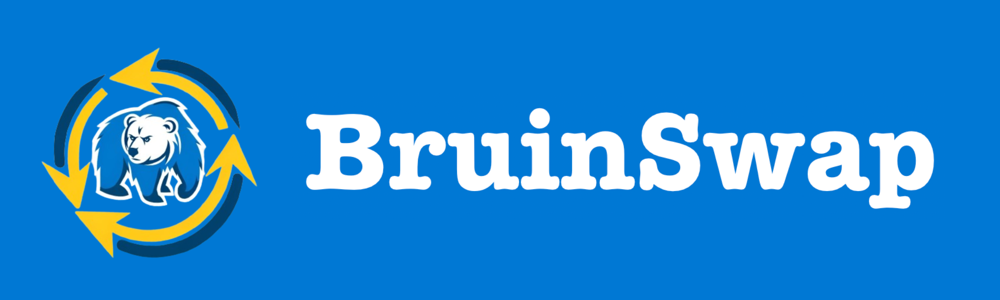

# BruinSwap



BruinSwap is a full-stack web application that allows students to post classes they intend to drop and coordinate class swaps with other students. 

## Link to Public Repository
This is the link to our public GitHub repository: [https://github.com/visyat/bruin-swap](https://github.com/visyat/bruin-swap)

## Installation/Setup

To download and run our application, first clone our git repository.
```
git clone https://github.com/visyat/bruin-swap.git
```

From here, place the required keys into the files `bruin-swap/express-server/.env` and `bruin-swap/client/.env.local`, to properly access our server, PostgreSQL database, and mail framework. 

Once you've done this, you can install dependencies for and run the server and frontend using the shell script we've provided (from within the main `bruin-swap` directory)

```
./setup.sh
```

The backend server will be available at `http://localhost:3000`. If you want to test individual routes, full instructions regarding available routes, request parameters/bodies, and outputs are available in the server README file: `express-server/README.md`. 

The frontend application will be available at `http://localhost:8080`

If you want to manually install the client and server dependencies, we've outlined the steps below — our shell script simply automates this process for convenience.

**NOTE: If you've already run the shell script above, you do not need to run the following commands.**

***

### Server
To install dependencies for our Express.js server, run the following commands: 
```
cd express-server
npm install
```
To run the server, enter the following command:

```
npm start
 ```

### Client
To install dependencies for our frontend application, run the following commands: 
```
cd client
npm i
```

In the `client` directory, place the following in a file named `.env.local` to allow the browser to connect to the server:
```
NEXT_PUBLIC_API_URI="http://localhost:3000"
```
To run the completed application, enter the following command: 

```
npm run dev
```

## Main Features 
1. **Creating Posts**: In the "Add Listing" Tab, users can create their own course swap proposal, stating a class they want to offer and a class they would like to get in exchange. 
2. **Reading and Accepting Posts**: In the "Listings" Tab, users can see posts created by other users, and choose to make those swaps if they have the class being requested. 
3. **Notification on Transaction**: In the "Account" Tab, users can save courses to their wishlist. When a new post is created offering that course, they will get a notification via email that this was the case, giving them the opportunity to make the trade. 

## Tech Stack 
* JavaScript 
* TypeScript
* Node.js
* Express.js
* React.js (Fluent UI)
* PostgreSQL

## References
Below are some tutorials we used to help guide our implementation: 
* https://blog.logrocket.com/crud-rest-api-node-js-express-postgresql/
* https://blog.logrocket.com/sending-emails-node-js-nodemailer/
* https://nathansmith.io/posts/scraping-enrollment-data-from-the-ucla-registrar-part-one/#fnref:4
* https://developer.mozilla.org/en-US/docs/Learn/Tools_and_testing/Client-side_JavaScript_frameworks/React_getting_started
* https://plainenglish.io/blog/how-to-implement-a-search-bar-in-react-js
* https://react.dev/learn

## Authors
BruinSwap was made as a project for COM SCI 35L (Winter 2024), taught by Professor Paul Eggert. It was built by Vishal Yathish, Rathul Anand, Aditya Pai, Christian Giron-Michel, and Matthew Day.  
