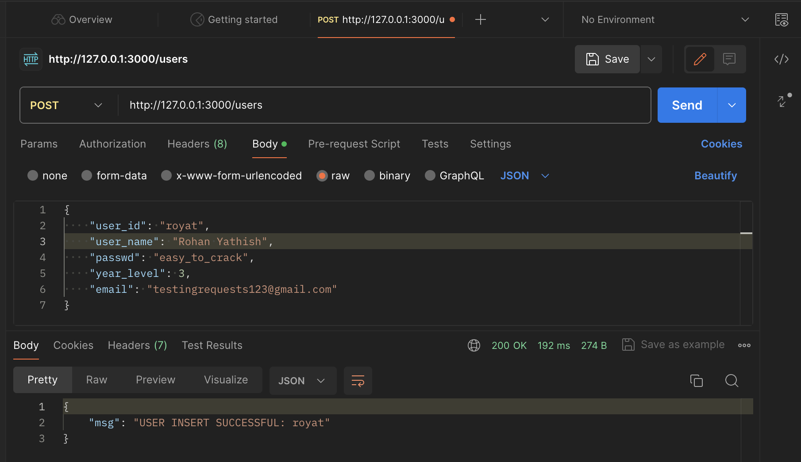

# Express (Node.js) Backend

## Installation/Setup

To download and test working queries, run the following commands: 

```
git clone https://github.com/visyat/35L-project.git
cd express-server
npm install
npm start
```
Access the server on ```http:/localhost:3000/```


## Currently supports the following: 

### GET Requests:

```/users``` - Provides a list of all users' IDs and names (meant for user directories)

```/check-valid/:user_id``` - Determines whether a given user ID is valid; user exists in the DB

```/check-user-exists/:user_id``` - Converse of above. Checks whether user is new (for registration), to prevent duplicate accounts. 

```/users-id/:user_id``` - Provides user information given user ID (hides secure/private information)

```/users/:user_jwt``` - Provides all user information given JWT token

```/login/:user_id/:passwd``` - **Takes in user ID and password, returns corresponding JWT token; meant for authentication**

```/transactions``` - Provides all active transactions (for the main page)

```/transactions-by-user/:user_jwt``` - Provides all transactions posted by a specific user (for user profile)

```/transactions-by-tid/:transaction_id``` - Provides transaction information for a specific transaction ID (searching)

```/transactions-by-dept/:dept``` - Provides all transactions where the class being offered is in the chosen department

```/transactions-by-cn/:course_num``` - Provides all transactions where the class being offered is a specific course number (will show all sections offered)

```/classes``` - Provides a list of all classes stored in DB

```/classes/:section_code``` - Provides class information for a specific section code

```/wishlist/:user_jwt``` - Gets all wishlist items for a specific user 

```/enrollments/:user_jwt``` - Gets all classes that a specific user is currently enrolled in

### POST Requests: 

```/users``` - Inserts new user into DB; Request Body: {user_id, user_name, passwd, year, email}

```/classes``` - Inserts new class; RB: {section_code, course_name}

```/transactions``` - Inserts new transaction; RB: {t_id, user_jwt, class_wanted, class_dropped}

```/wishlist``` - Inserts a new wishlist item to a specific user; RB: {user_jwt, class_wished}

```/enrollments``` - Inserts a new class enrolled for a specific user; RB: {user_jwt, class_enrolled}

### PUT Requests: 

```/users/:user_jwt``` - Updates information for a specific user; RB: {user_name, passwd, year_level, email}

```/courses/:section_code```- Updates a course's information/name; RB: {sec_section_code, course_name}

```/transactions/:transaction_id``` - Updates information for specific transaction; RB: {class_wanted, class_to_drop}


### DELETE Requests: 

```/users/:user_jwt``` - Deletes a user (will delete all transactions they posted)

```/courses/:section_code``` - Deletes a section

```/courses/:dept/:course_num``` - Deletes all sections given a department abbreviation and course number

```/transactions/:transaction_id``` - Deletes a transaction

```/wishlist/:user_jwt/:section_id``` - Deletes a specific section from a user's wishlist 

```/enrollments/:user_jwt/:section_id``` - Deletes a section from a user's current enrollments

## Testing

GET requests can be tested in the search browser directly. POST, PUT, and DELETE requests can be tested with Postman (to insert request bodies). 

Here is an example: 

